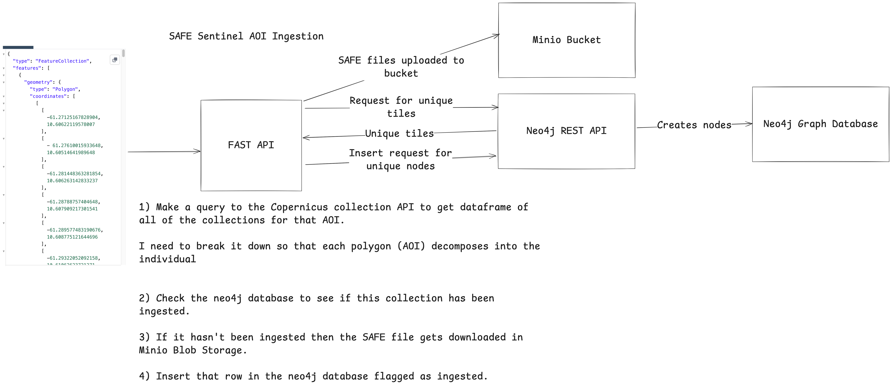

# Sentinel SAFE REST API
A FASTAPI Server that downloads the full SAFE datasets for areas via a Geojson API Endpoint. Meant to be very simple and ingests the compressed SAFE directories for areas of interest. Meant to be comparable with my Neo4j REST API interface and the Neo4j Datalake that I've been using for other projects.

